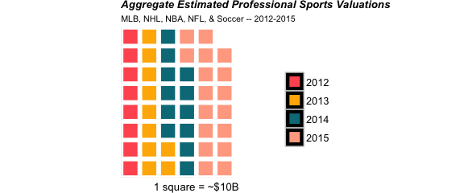
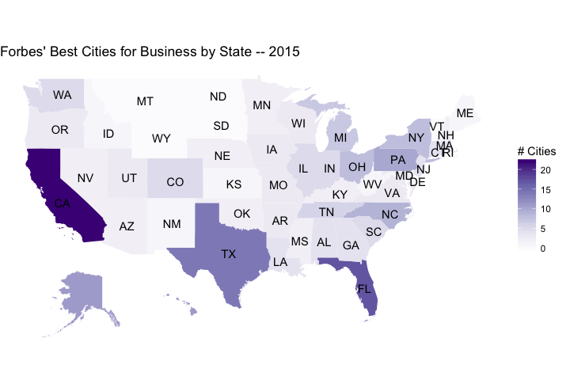

<!-- README.md is generated from README.Rmd. Please edit that file -->

forbesListR - An easy way to access the data contained lists maintained by the fine folks at [Forbes](http://www.forbes.com/) in [R](cran.r-project.org)

### Why I Built `forbesListR`?

Forbes is the preiminant maintainer of covering a wide range of business related topics including sports, entertainment, individual wealth, and locations. The lists are chocked full of phenomonal data that can be analyzed, visualized and merged with other data. Upon discovering that Forbes went to the pains of building an API, even though it is undocumented, I decided to build this package to wrap that API and make it as easy as possible for my fellow \#rstats brethren to access this data with a few simple functions.

As of now this package has 3 primary functions that I hope become widely used.

-   `get_year_forbes_list_data`: Gets the data contained in a Forbes list if it exists
-   `get_years_forbes_list_data`: Gets the data contained in multiple years of a specified list
-   `get_year_list_forbes_bio_data`: Gets the page specific for the people contained in a specific list

If and when Forbes adds new lists I will update this package to include them.

### Accessible Lists

-   Billionaires
-   Forbes 400
-   Top VCs
-   Athletes
-   Celebrities
-   NBA Valuations
-   MLB Valuations
-   NFL Valuations
-   NHL Valuations
-   Soccer Valuations
-   NASCAR Valuations
-   Powerful Brands
-   Growth Companies
-   Best Employers
-   Powerful People
-   Powerful Women
-   Top Colleges
-   Top Business Schools
-   Innovative Companies
-   Small Companies
-   Best Employers
-   Largest Private Companies
-   Global 2000
-   Richest Families
-   Self Made Women
-   Most Promising Companies
-   Best Countries for Business
-   Best Cities for Business
-   Best States for Business
-   Best Small Cities for Business
-   Richest in Tech
-   Hong Kong 50
-   Australia 50
-   China 50
-   Taiwan 50
-   India 50
-   Japan 50
-   Africa 50
-   Korea 50
-   Malaysia 50
-   Philippines 50
-   Singapore 50
-   Indonesia 50
-   Thailand 50
-   Asia 200
-   Asia Fab 50

### Installation

``` r
devtools::install_github("abresler/forbesListR")
```

### Usage

#### Get 2016 NBA Team Valuations

``` r
library(forbesListR)
nba_2016_values <- 
  get_year_forbes_list_data(list = "NBA Valuations", year = 2016)

top_10_2016 <- 
  nba_2016_values %>% 
  dplyr::select(year, team, valuation.millions) %>% 
  head(10)
```

|  year| team                  |  valuation.millions|
|-----:|:----------------------|-------------------:|
|  2016| New York Knicks       |                3000|
|  2016| Los Angeles Lakers    |                2700|
|  2016| Chicago Bulls         |                2300|
|  2016| Boston Celtics        |                2100|
|  2016| Los Angeles Clippers  |                2000|
|  2016| Golden State Warriors |                1900|
|  2016| Brooklyn Nets         |                1700|
|  2016| Houston Rockets       |                1500|
|  2016| Dallas Mavericks      |                1400|
|  2016| Miami Heat            |                1300|

#### Get Top Venture Capitalists from 2012 to 2016

``` r
vcs_2012_2016 <- 
  get_years_forbes_list_data(years = 2012:2016, list_name = "Top VCs")
vcs_2012_2016 %>% 
  dplyr::glimpse()
# Observations: 475
# Variables: 15
# $ year           (int) 2016, 2016, 2016, 2016, 2016, 2016, 2016, 2016, 2016, 2016, 2016, 2016, 2016, 2016, 2016, 20...
# $ list           (chr) "Top VCs", "Top VCs", "Top VCs", "Top VCs", "Top VCs", "Top VCs", "Top VCs", "Top VCs", "Top...
# $ name           (chr) "Jim Goetz", "Steve Anderson", "Chris Sacca", "Peter Fenton", "Mary Meeker", "Josh Kopelman"...
# $ last_name      (chr) "Goetz", "Anderson", "Sacca", "Fenton", "Meeker", "Kopelman", "Shen", "Gurley", "Leone", "Th...
# $ company        (chr) "Sequoia Capital", "Baseline Ventures", "Lowercase Capital", "Benchmark", "Kleiner Perkins C...
# $ is.government  (lgl) FALSE, FALSE, FALSE, FALSE, FALSE, FALSE, FALSE, FALSE, FALSE, FALSE, FALSE, FALSE, FALSE, F...
# $ position       (int) NA, NA, NA, NA, NA, NA, NA, NA, NA, NA, NA, NA, NA, NA, NA, NA, NA, NA, NA, NA, NA, NA, NA, ...
# $ rank           (int) 1, 2, 3, 4, 5, 6, 7, 8, 9, 10, 11, 12, 13, 14, 15, 16, 17, 18, 19, 20, 21, 22, 23, 24, 25, 2...
# $ age            (int) 50, 47, 40, 43, 56, 44, 46, 49, 58, 48, 54, 59, 50, 51, 44, 52, 54, 48, 48, 51, 45, 64, 42, ...
# $ url.bio.forbes (chr) "http://www.forbes.com/profile/jim-goetz", "http://www.forbes.com/profile/steve-anderson", "...
# $ url.image      (chr) "http://i.forbesimg.com/media/lists/people/jim-goetz_200x200.jpg", "http://i.forbesimg.com/m...
# $ gender         (chr) "M", "M", "M", "M", "F", "M", "M", "M", "M", "M", "M", "M", "M", "M", "M", "M", "M", "M", "M...
# $ country        (chr) "United States", "United States", "United States", "United States", "United States", "United...
# $ description    (chr) "A year-and-a-half after the sale of WhatsApp to Facebook for near $22 billion, Jim Goetz co...
# $ notableDeal    (chr) "WhatsApp", "Instagram", "Twitter", "Twitter", "Facebook", "LinkedIn", "Alibaba", "Uber", "F...
```

#### Get Detailed Biography Data for 2015 Top Athletes - Explore Earnings by Maritial Status

``` r
library(dplyr)
athletes_2015 <- 
  get_year_list_forbes_bio_data(year = 2015, list_name = 'Athletes')
# Warning: closing unused connection 5 (http://www.forbes.com/profile/russell-westbrook)

athletes_2015 <- 
  athletes_2015 %>% 
  group_by(martial_status) %>% 
  summarise(earnings.millions = sum(salary_earnings.millions, na.rm = T)) %>% 
  arrange(desc(earnings.millions)) %>% 
  ungroup
```

| martial\_status |  earnings.millions|
|:----------------|------------------:|
| Married         |             1257.3|
| Single          |              939.1|
| Divorced        |              659.0|
| Engaged         |               58.5|
| NA              |               33.1|

Sample Data Visualizations
--------------------------

Waffle Chart of Aggregate Professional Sport Valuations by Year
---------------------------------------------------------------

``` r
nba_valuations <-
  2012:2016 %>%
  get_years_forbes_list_data(list_name = "NBA Valuations")

nhl_valuations <-
  2012:2016 %>%
  get_years_forbes_list_data(list_name = "NHL Valuations")

mlb_valuations <-
  2012:2016 %>%
  get_years_forbes_list_data(list_name = "MLB Valuations")

nfl_valuations <-
  2012:2016 %>%
  get_years_forbes_list_data(list_name = "NFL Valuations")

soccer_valuations <-
  2012:2016 %>%
  get_years_forbes_list_data(list_name = "Soccer Valuations")

all_valuation_data <-
  nba_valuations %>%
  bind_rows(nhl_valuations) %>%
  bind_rows(mlb_valuations) %>%
  bind_rows(soccer_valuations) %>%
  bind_rows(nfl_valuations) %>%
  mutate(list = list %>% str_replace_all(' Valuations', '')) %>%
  dplyr::filter(year %in% c(2012:2016))
```

``` r
library(waffle) # devtools::install_github("hrbrmstr/waffle")
# Loading required package: ggplot2
library(ggplot2) # devtools::install_github("hadley/ggplot2")

total_by_year <- 
  all_valuation_data %>% 
  dplyr::filter(year %in% c(2012:2015)) %>% 
  group_by(year) %>% 
  summarise(aggregate_valuation.billions = sum(valuation.millions, na.rm = T) / 1000)

totals <- 
  total_by_year$aggregate_valuation.billions / 10

names(totals) <- 
  total_by_year$year

sports_waffle_valuations <- 
  totals %>% 
  waffle(flip = F, size = 2, rows = 8, xlab = '1 square = ~$10B',  pad = 1,
         colors = c("#FF5A5F","#FFB400", "#007A87", "#FFAA91", "#7B0051")) +
  labs(title = "Aggregate Estimated Professional Sports Valuations",
       subtitle = "MLB, NHL, NBA, NFL, & Soccer -- 2012-2015") +
  theme(plot.subtitle = element_text(
    size = 8,
    hjust = 0
  ),
  plot.title = element_text(size = 10, face = "bold.italic")
  )
```

``` r
sports_waffle_valuations
```

<!-- -->

Streamgraph of Valuations by Sport, 2012 - 2016
-----------------------------------------------

``` r
  summary_cols <-
    c('valuation.millions', 'revenue.millions', 'operating_income.millions', 'debt.millions')
  
  summary_data <-
    all_valuation_data %>%
    dplyr::rename(sport = list) %>%
    group_by(year, sport) %>%
    summarise_each_(funs(sum(., na.rm = T)), summary_cols) %>%
    mutate(revenue.multiple = valuation.millions / revenue.millions,
           ebitda.multiple = valuation.millions / operating_income.millions) %>%
    ungroup
```

``` r
library(streamgraph) # devtools::install_github('hrbrmstr/streamgraph')

nba_streamgraph <- 
  summary_data %>%
  streamgraph("sport",
              "valuation.millions",
              "year",
              offset = "silhouette",
              interpolate = "step") %>%
  sg_axis_x(1, "year", "%Y") %>%
  sg_fill_brewer(palette = "Spectral") %>%
  sg_legend(show = TRUE, label = "Sport: ")
```

### Choroplething Forbes 2015 Best Cities for Small Business by State

#### Example from [Aaron Miles](https://twitter.com/_aaronmiles)

``` r
chor_packages <-
  c('dplyr', 'choroplethr', 'RColorBrewer', 'ggplot2', 'magrittr')

lapply(chor_packages, library, character.only = T)
# [[1]]
#  [1] "streamgraph" "waffle"      "ggplot2"     "rvest"       "xml2"        "jsonlite"    "forbesListR" "stats"      
#  [9] "graphics"    "grDevices"   "utils"       "datasets"    "stringr"     "purrr"       "tidyr"       "formattable"
# [17] "readr"       "dplyr"       "magrittr"    "methods"     "base"       
# 
# [[2]]
#  [1] "choroplethr" "streamgraph" "waffle"      "ggplot2"     "rvest"       "xml2"        "jsonlite"    "forbesListR"
#  [9] "stats"       "graphics"    "grDevices"   "utils"       "datasets"    "stringr"     "purrr"       "tidyr"      
# [17] "formattable" "readr"       "dplyr"       "magrittr"    "methods"     "base"       
# 
# [[3]]
#  [1] "RColorBrewer" "choroplethr"  "streamgraph"  "waffle"       "ggplot2"      "rvest"        "xml2"        
#  [8] "jsonlite"     "forbesListR"  "stats"        "graphics"     "grDevices"    "utils"        "datasets"    
# [15] "stringr"      "purrr"        "tidyr"        "formattable"  "readr"        "dplyr"        "magrittr"    
# [22] "methods"      "base"        
# 
# [[4]]
#  [1] "RColorBrewer" "choroplethr"  "streamgraph"  "waffle"       "ggplot2"      "rvest"        "xml2"        
#  [8] "jsonlite"     "forbesListR"  "stats"        "graphics"     "grDevices"    "utils"        "datasets"    
# [15] "stringr"      "purrr"        "tidyr"        "formattable"  "readr"        "dplyr"        "magrittr"    
# [22] "methods"      "base"        
# 
# [[5]]
#  [1] "RColorBrewer" "choroplethr"  "streamgraph"  "waffle"       "ggplot2"      "rvest"        "xml2"        
#  [8] "jsonlite"     "forbesListR"  "stats"        "graphics"     "grDevices"    "utils"        "datasets"    
# [15] "stringr"      "purrr"        "tidyr"        "formattable"  "readr"        "dplyr"        "magrittr"    
# [22] "methods"      "base"

# Read in Forbes Data
dat <-
  get_year_forbes_list_data(list = "Best Cities for Business", year = 2015)

#Summarize Number of Cities by State
bus <-
  dat %>%
  group_by(state) %>%
  summarize(cities = n_distinct(city)) %>%
  mutate(state = state %>% tolower())


#Read in Choroplethr Data
data("df_state_demographics")

# Merge with cities Data
df_state_demographics <-
  df_state_demographics %>%
  left_join(bus, by = c("region" = "state"))

#Fill NAs as 0 (States with no cities)
df_state_demographics[is.na(df_state_demographics)] <-
  0

#Set value to be city
df_state_demographics <-
  df_state_demographics %>%
  mutate(value = cities)

#Create Plot
choro1 <- StateChoropleth$new(df_state_demographics)
choro1$title = "Forbes' Best Cities for Business by State -- 2015"
choro1$set_num_colors(1)
choro1$ggplot_polygon = geom_polygon(aes(fill = value), color = NA)
choro1$ggplot_scale = scale_fill_gradientn(name = "# Cities",
                                           colours = brewer.pal(8, "Purples"))
```

``` r
choro1$render()
```


